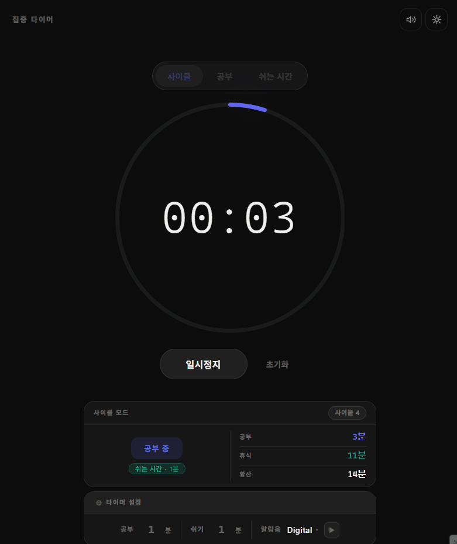
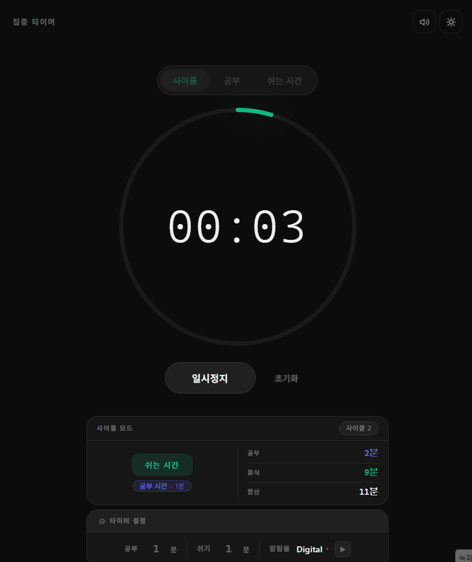
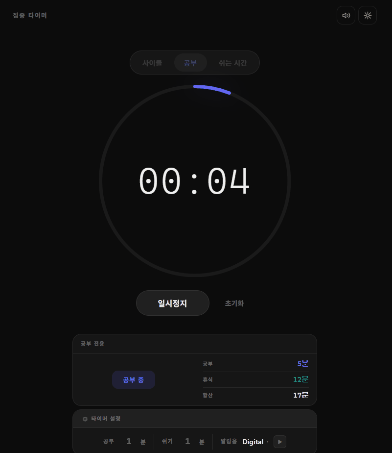
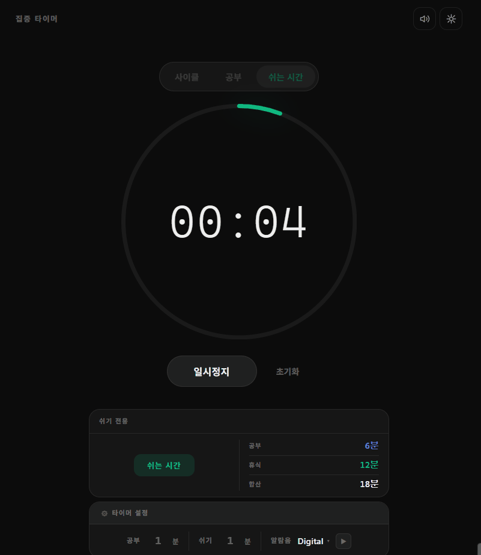
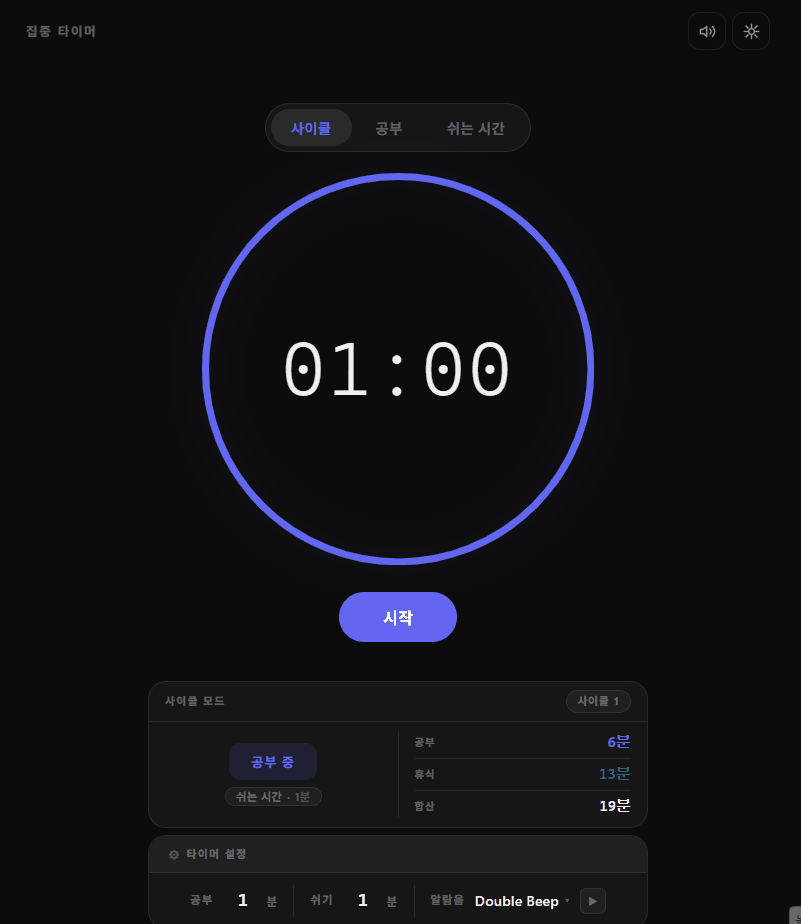
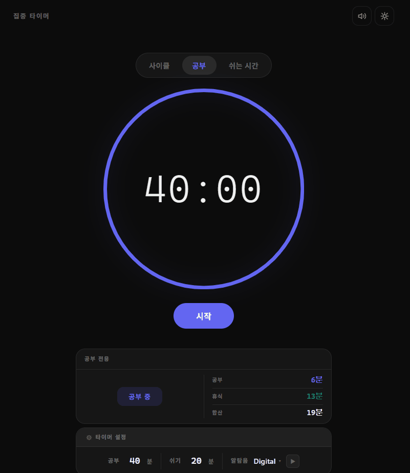

# Flow Timer

> 공부·휴식 사이클을 자동으로 관리하는 **미니멀 집중 타이머**

<!-- screenshot -->


[](https://reactjs.org)
[](https://www.typescriptlang.org)
[](https://vitejs.dev)

---

## 목차

1. [프로젝트 소개](#-프로젝트-소개)
2. [기술 스택](#-기술-스택)
3. [화면 구성](#-화면-구성)
4. [주요 기능](#-주요-기능)
5. [기술적 특징](#-기술적-특징)
6. [시작 가이드](#-시작-가이드)
7. [폴더 구조](#-폴더-구조)

---

## 🕐 프로젝트 소개

Flow Timer는 공부와 휴식 사이클을 직관적으로 관리하는 **웹 기반 집중 타이머**입니다.

- 뽀모도로 방식의 **공부 ↔ 휴식 자동 전환** 사이클을 지원합니다.
- 단계 전환 시 **8가지 알람음** 중 원하는 소리를 선택해 청각 피드백을 받을 수 있습니다.
- 오늘 하루 집중한 시간과 쉰 시간을 **일일 통계**로 확인할 수 있습니다.
- 외부 UI 라이브러리 없이 React + TypeScript만으로 구현한 **경량 SPA**입니다.

### 배포 주소
> https://flow-timer-six.vercel.app/

---

## 🛠 기술 스택

| 분류 | 기술 | 비고 |
|------|------|------|
| Framework | React 18.3 | 함수형 컴포넌트 + Custom Hooks |
| Language | TypeScript 5.5 | strict 모드 |
| Build | Vite 5.4 | HMR, 최적화 번들 |
| Styling | CSS (CSS Variables) | 다크/라이트 테마, 반응형 |
| Audio | Web Audio API | 알람음 합성, AudioContext 관리 |
| Storage | localStorage | 설정 + 일일 통계 영속화 |
| 외부 의존성 | 없음 | React / React-DOM 외 UI 라이브러리 미사용 |

---

## 🖥 화면 구성

<!-- screenshot -->
### 화면 흐름도


| 다크 모드 | 라이트 모드 |
|:---------:|:-----------:|
|  |   |

| 설정 패널 | 일일 통계 |
|:---------:|:---------:|
|  |  |

---

## ✨ 주요 기능

### 1. 세 가지 타이머 모드

- **사이클 모드** — 공부 → 휴식을 자동으로 반복. 각 단계 전환마다 알람음 재생
- **집중 모드** — 공부 구간만 단독 실행
- **휴식 모드** — 휴식 구간만 단독 실행

<!-- screenshot -->
#### - 사이클 모드 (자동 변환)

<p>
    
    
</p>
<p>
    
    
</p>


#### - 집중 모드


#### - 휴식 모드


## 2. 사용자 설정

### 2-1. 커스텀 동작

- 공부 시간 / 휴식 시간을 분 단위로 자유 설정 (기본값: 공부 40분, 휴식 20분)
- 변경 사항은 localStorage에 자동 저장, 새로고침 후에도 유지

### 2-2. 오디오 알람 시스템

- **8종 프리셋:** Beep 1, Beep 2, Soft Bell, Digital, Chime, Double Beep, Soft Alert, Focus End
- 선택 즉시 **미리 듣기(Preview)** 가능
- 공부 종료 / 휴식 종료 시 **서로 다른 음색** 재생
- 브라우저 자동재생 정책 대응 — 사용자 인터랙션 이후 AudioContext 재개

### 2-3. 일일 집중 통계

- 오늘의 **총 집중 시간 / 총 휴식 시간** 실시간 집계
- 날짜 변경 시 자동 초기화
- 페이지 이탈(`beforeunload`) 시 진행 중인 구간 시간 자동 캡처




### 3. 테마 & 반응형 UI

- 다크 모드 / 라이트 모드 토글 (CSS 변수 기반 전체 테마 전환)
- 모바일(320px) ~ 데스크톱(1920px+) 전 구간 대응
- SVG 원형 프로그레스 링, 대형 모노스페이스 카운트다운 표시
- `prefers-reduced-motion` 미디어 쿼리 지원


---

## 🚀 시작 가이드

### 요구 사항

- Node.js 18+

### 설치 및 실행

```bash
# 저장소 클론
git clone https://github.com/your-username/flow-timer.git
cd flow-timer

# 의존성 설치
npm install

# 개발 서버 실행
npm run dev

```

---

## 📁 폴더 구조

```
src/
├── main.tsx                  # 앱 진입점
├── App.tsx                   # 루트 컴포넌트 및 상태 연결
├── index.css                 # 전역 스타일 (CSS Variables + 미디어 쿼리)
├── types/
│   └── timer.ts             # TimerState, TimerAction, Phase, Mode 타입 정의
├── hooks/
│   ├── useTimer.ts          # 타이머 핵심 로직 (Reducer + RAF 루프)
│   ├── useStats.ts          # 일일 통계 집계 및 날짜 롤오버
│   ├── useTheme.ts          # 다크/라이트 테마 토글
│   └── useTitleFavicon.ts   # 탭 제목 & 파비콘 실시간 업데이트
├── components/
│   ├── TimerDisplay.tsx     # 원형 프로그레스 링 + 카운트다운 표시
│   ├── ProgressRing.tsx     # SVG 원형 프로그레스 인디케이터
│   ├── TimerControls.tsx    # 시작 / 일시정지 / 재개 / 초기화 버튼
│   ├── ModeTabs.tsx         # 사이클 / 집중 / 휴식 모드 탭
│   ├── SettingsPanel.tsx    # 시간 설정 입력 + 알람 선택 드롭다운
│   ├── InfoCard.tsx         # 단계 정보 + 일일 통계 표시
│   └── PhaseInfo.tsx        # 현재 단계 배지 + 다음 단계 힌트
└── utils/
    ├── audio.ts             # Web Audio API 알람 구현 (8종 프리셋)
    ├── storage.ts           # localStorage 헬퍼 (설정 읽기/쓰기)
    ├── format.ts            # 시간 포맷 유틸 (MM:SS)
    └── favicon.ts           # 파비콘 업데이트 유틸
```
